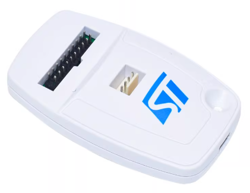
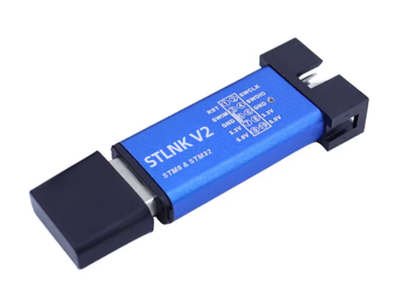

# XRDAP-F103C8

适配常见 STLINK V2 硬件形态的 DAPLink/CMSIS-DAP 固件。

## 测试设备

### STLINK V2 标准版

### STLINK V2 淘宝铝壳版

## 支持芯片与推荐时钟

- Probe MCU：`STM32F103C8` / `APM32F103C8`
- Target（性能测试对象）：`STM32H723ZGTx`
- 推荐：
  - `STM32F103C8`：`72M`
  - `APM32F103C8`：`96M`（`72M` 也可用）

## 引脚定义

- `PB6`: `nRESET`
- `PA12`: `USB_DP`
- `PA11`: `USB_DM`
- `PA9`: `LED`
- `PB14`: `SWDIO`
- `PB13`: `SWCLK`

接线注意：
- `STLINK V2` 标准版通常在 `SWDIO` 上没有板载上拉电阻，需要依赖目标板上拉，或手动外加上拉电阻。

## 时钟模式与构建

参考LibXR官方教程编译，一次编译直接生成 `72M/96M` 两个固件：

## 72M / 96M 性能实测

单位：`KiB/s`

- SWD 速率：`5000` / `10000`（OpenOCD 与 probe-rs 分别在同速率下测试）
  - OpenOCD：`load_image + dump_image`
  - probe-rs：`download(bin@0x24000000) + read(b32 0x24000000 32768)`
- Flash：`128KiB`
  - OpenOCD：`erase + flash write_image + verify_image`
  - probe-rs：`erase + download + verify`（擦除按 `1MiB` 归一化）

| 模式 | SWD速率 | OpenOCD SRAM写 | OpenOCD SRAM读 | OpenOCD Flash擦除 | OpenOCD Flash编程 | OpenOCD Flash校验 | probe-rs SRAM写 | probe-rs SRAM读 | probe-rs Flash擦除 | probe-rs Flash编程 | probe-rs Flash校验 |
| ---- | ------: | -------------: | -------------: | ----------------: | ----------------: | ----------------: | --------------: | --------------: | -----------------: | -----------------: | -----------------: |
| 72M  |    5000 |         246.71 |         200.95 |            143.05 |            113.06 |            943.45 |          137.24 |           39.92 |              74.40 |              33.50 |             125.05 |
| 72M  |   10000 |         246.87 |         201.63 |            144.05 |            113.05 |            942.50 |          137.03 |           40.00 |              74.42 |              33.44 |             125.20 |
| 96M  |    5000 |         311.03 |         252.23 |            143.92 |            113.96 |            952.52 |          152.76 |           48.04 |              74.45 |              34.28 |             145.01 |
| 96M  |   10000 |         311.04 |         251.56 |            146.18 |            113.94 |            952.72 |          153.47 |           48.15 |              74.66 |              34.42 |             145.90 |

## ST-LINK V2 对照实测

单位：`KiB/s`

- Probe 固件：`ST-LINK V2J46S7`
- RAM：`128KiB`（写入/读出 `0x24000000`）
- Flash：`128KiB`（`program + verify`）

| 模式           | SWD速率 | OpenOCD SRAM写 | OpenOCD SRAM读 | OpenOCD Flash编程+校验 | CubeCLI SRAM写 | CubeCLI SRAM读 | CubeCLI Flash编程+校验 |
| -------------- | ------: | -------------: | -------------: | ---------------------: | -------------: | -------------: | ---------------------: |
| STLINK_V2J46S7 |     480 |          28.14 |          31.50 |                  44.62 |          22.96 |          24.91 |                  11.56 |
| STLINK_V2J46S7 |    1800 |          78.13 |          80.57 |                  47.50 |          45.96 |          46.21 |                  22.66 |
| STLINK_V2J46S7 |    4000 |         115.01 |         112.64 |                  47.79 |          56.30 |          55.05 |                  26.86 |

## DAPLink vs ST-LINK 对比（OpenOCD）

单位：`KiB/s`

- 对比口径：
  - DAPLink：取上方 `96M @ 5000` 实测
  - ST-LINK：取上方 `V2J46S7 @ 4000` Top25 实测
  - Flash 编程+校验（DAPLink）由 `Flash编程` 与 `Flash校验` 两阶段换算得到：`101.78 KiB/s`

| 指标                   | DAPLink (96M@5000) | ST-LINK V2J46S7 (4000) | DAPLink 相对提升 |
| ---------------------- | -----------------: | ---------------------: | ---------------: |
| OpenOCD SRAM写         |             311.03 |                 115.01 |         +170.44% |
| OpenOCD SRAM读         |             252.23 |                 112.64 |         +123.93% |
| OpenOCD Flash编程+校验 |             101.78 |                  47.79 |         +112.97% |
